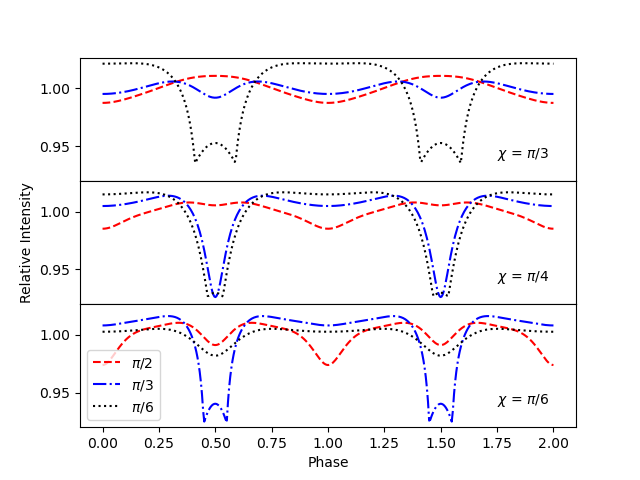
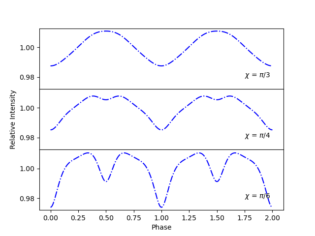

Prepare lightcurves for different neutron star orientations
===========================================================

Here we model lightcurves, with various values of 'chi' and 'inclination', in
an attempt to show how the orientation between the magnetic axis, spin axis, 
and the observer changes the relative intensity.

See :ref:`lcurve` for more details on how to produce lightcurves produced by 
two opposite hotspots.

We again import ``Magpies`` and ``numpy``, ``math`` and ``matplotlib`` 
packages.

.. code-block:: python

    from magpies import *
    from atmos import *
    import numpy as np
    from math import *
    import matplotlib.pyplot as plt

We initialise basic neutron stars properties.

.. code-block:: python

    Rns = 10  ## km
    Mns = 1.8 ## M_solar

Further we create a surface thermal map which is filled with zeros and place 
two hot spots at opposite locations with temperature :math:`T = 10^6` K.

.. code-block:: python

    Tm = Tmap (usage='zero')                              ## Surface thermal map filled with zeros
    Tm.Ts[0, int(len(Tm.theta)/2)] = 1e6                  ## First hot spot located at phi = 0, theta = pi/2
    Tm.Ts[int(len(Tm.phi)/2), int(len(Tm.theta)/2)] = 1e6 ## Second antipodal hot spot, phi = pi, theta = pi/2

Next, we create an array where we store all rotational phases.

.. code-block:: python

    phases = np.linspace (0, 4*pi, 400) ## Phases where we compute the lightcurve
    phase = np.asarray(phases) / pi / 2 ## Converting phase angle to phase
    
Now we need to define the desired values of chi and the inclination. We will 
produce 3 plots, each with a different value for chi. On each plot we will have
3 curves corresponding to the values of the inclination.

.. code-block:: python

    chi=[pi/3,pi/4,pi/6] 
    inclination=[pi/2,pi/3,pi/6]

We use these values to create a vector, whos values will by lists of the relative
intensitys for the various orientations. 

.. code-block:: python

    intensity=[]
    for i in range(3):
        for j in range(3):
            intens = lightcurve (Tm, Rns, Mns, phases, chi[i], inclination[j]) ##Uses the 'chi' and 'inclination' angles to calculate intensity 
            inten = np.asarray(intens) / np.mean(intens) ##Transforming to absolute values
            intensity.append(inten)

We use these values to plot our subplots.

.. code-block:: python
    
    fig, axs = plt.subplots(3,sharex=True,sharey=True) ##Creates a subplot with 3 plots, all 3 plots will share x and y axis

    st=['r--', 'b-.','k:','r--', 'b-.','k:','r--', 'b-.','k:'] ##Defines the line types

    for i in range(9): ##Plots each curve
        if i<3:
            axs[0].plot (phase, intensity[i], st[i]) ##Subplot 1
        elif i>5:
            axs[2].plot (phase, intensity[i], st[i]) ##Subplot 3
        else :
            axs[1].plot (phase, intensity[i], st[i]) ##Subplot 2

    plt.subplots_adjust(hspace=.0) ##This merges the plots 
    
    axs[0].text(1.75, 0.94, '$\chi$ = $\pi$/3')
    axs[1].text(1.75, 0.94, '$\chi$ = $\pi$/4')
    axs[2].text(1.75, 0.94, '$\chi$ = $\pi$/6')
    plt.legend(["$\pi$/2", "$\pi$/3", "$\pi$/6"],loc='lower left')

    axs[1].set_ylabel('Relative Intensity')
    axs[2].set_xlabel('Phase')

This method can be adjusted to compare any number of lightcurves, for various 
chi or inclination. For example, the code below will create 3 plots for various
chi, but holds the inclination constant at pi/2.

.. code-block:: python

    chi=[pi/3,pi/4,pi/6] 
    inclination=[pi/2]

    intensity=[]
    for i in range(3):
        for j in range(3):
            intens = lightcurve (Tm, Rns, Mns, phases, chi[i], inclination)  
            inten = np.asarray(intens) / np.mean(intens)
            intensity.append(inten)
        
    fig, axs = plt.subplots(3,sharex=True,sharey=True) 

    for i in range(9): ##Plots each curve
        if i<3:
            axs[0].plot (phase, intensity[i],'b-.')
        elif i>5:
            axs[2].plot (phase, intensity[i],'b-.')
        else:
            axs[1].plot (phase, intensity[i],'b-.')

    axs[0].text(1.75, 0.98, '$\chi$ = $\pi$/3')
    axs[1].text(1.75, 0.98, '$\chi$ = $\pi$/4')
    axs[2].text(1.75, 0.98, '$\chi$ = $\pi$/6')

    plt.subplots_adjust(hspace=.0) 

    axs[1].set_ylabel('Relative Intensity')
    axs[2].set_xlabel('Phase')

Thus will give the following graph.

