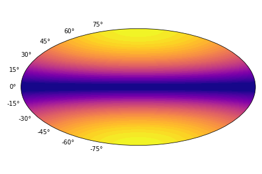

Initialising the surface thermal map
=====================================

The code provides a few distinct ways to create surface thermal map.
Here we consider all important options. 

-------------------------------
Using NS atmospheric model
-------------------------------

The simplest way to initialise a new surface temperature distribution 
is by using a numerical fit which relates deep crust temperature with the top of the
atmosphere temperature assuming axi-symmetric dipolar magnetic field.
These theoretical fits are implemented in :py:mod:`atmos.NS_atmosphere`
class. We start with importing python packages which will be required.

.. code-block:: python

    from magpies import *
    from atmos import *
    import numpy as np
    from math import *

After this we choose essential parameters of the neutron star such as its radius, mass (to compute
compactness), deep crust temperature and strength of the polar magnetic field.
We additionally compute the free fall acceleration for selected radius and mass using
method :py:mod:`magpies.g14`.

.. code-block:: python

    Rns = 12  ## km
    Mns = 1.4 ## M_solar
    Tb = pow(10, 7.1730)  ## K
    Bp = 1e11 ## G
    g14c = g14 (Rns, Mns)

Now we have all required parameters to initialise the :py:mod:`atmos.NS_atmosphere` class.

.. code-block:: python

    atm_iron_2003 = NS_atmosphere ('Potekhin_2003_iron', g14c, Tb, Bp)

We will pass the member of this class to our :py:mod:`atmos.Tmap` class:

.. code-block:: python

    Tm = Tmap (usage='NS_atm', ns_atm=atm_iron_2003)

This class creates thermal map using the atmospheric model and :math:`N_\theta = 100` and :math:`N_\phi = 99` by default.
It is possible to pass different mesh size as the argument.

.. code-block:: python

    Tm = Tmap (usage='NS_atm', ns_atm=atm_iron_2003, Ntheta = 20, Nphi = 10)

The result is the class member which contains the following components: Ts, theta, phi. The Tm.Ts is
two dimensional array containing temperatures at each point of the grid, theta and phi are
one dimensional arrays containing latitudes and longuitudes of grid points. This class
also has a method :py:mod:`atmos.Tmap.Ts` which allows to plot and store the 
surface thermal map in Aitoff projection.

.. code-block:: python

    Tm.plot_Ts()

----------------------------------------
Creating isolated hot spots
----------------------------------------

Isolated hot spots can be created by direcly editing Tm.Ts array. So, 
it is possible to initialise empy :py:mod:`atmos.Tmap` class with necessary size and add
a hot region :math:`T = 10^6` K close to the pole.

.. code-block:: python

    Tm = Tmap (usage='zero',  Ntheta = 20, Nphi = 10)
    Tm.Ts[2, 2] = 1e6
    Tm.plot_Ts()

.. image:: ../images/Ts_single_hot_spot.png

Here we work with low resolution surface thermal map that is why the single pixel hot spot seems relatively large.
Poisiton and size of hot spots needs to be coordinated with the surface thermal map resolution.

-----------------------------------------------
Constracting the surface thermal map
-----------------------------------------------

If a surface thermal map is stored in some external
file, it is possible to pass this map as parameters
while creating the :py:mod:`atmos.Tmap` class. 

.. code-block:: python

   Tm = Tmap (usage='Ts', theta=theta_list, phi=phi_list, Ts = Ts)

The array storing the map should have the following structure :math:`\mathrm{Ts}[\phi, \theta]`.
All functions assume that surface mesh is uniform. 

