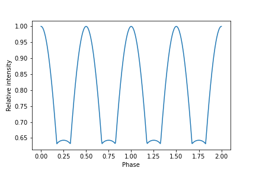

Lightcurve produced by two opposite hotspots
=========================================================================

Here we model lightcurves produced by two opposite hot spots following 
article [1]_. 

We import ``Magpies`` and ``numpy``, ``math`` and ``matplotlib`` packages which
are typically handful:

.. code-block:: python

    from magpies import *
    import numpy as np
    from math import *
    import matplotlib.pyplot as plt

We initialse basic neutron star properties.

.. code-block:: python

    ## Radius and mass of neutron star
    ## (a) panel
    Rns = 10  ## km
    Mns = 1.8 ## M_solar

Further we create a surface thermal map with which is filled with zeros. We place two
hot spots (areas with temperature :math:`T = 10^6` K) at opposite locations.

.. code-block:: python

    phi   = np.linspace (0, 2*pi, 99)           ## phi coordinates
    theta = np.linspace (0, pi, 100)             ## theta coordinates
    Ts    = np.zeros ((len(phi), len(theta)))    ## Surface thermal map
    Ts[0, int(len(theta)/2)] = 1e6               ## First hot spot located at phi = 0, theta = pi/2
    Ts[int(len(phi)/2), int(len(theta)/2)] = 1e6 ## Second antipodal hot spot, phi = pi, theta = pi/2

We choose the size of array ``phi`` as 99 because it allows us to get a better numerical accuracy.
Next, we create array where we store all rotational phases. We also compute the lightcurve 
using function :py:mod:`magpies.lightcurve()`.

.. code-block:: python

    phases = np.linspace (0, 4*pi, 400) ## Phases where we compute the lightcurve
    intens = lightcurve (theta, phi, Ts, Rns, Mns, phases, 0, pi/2) ## last two arguments are chi and inclination

    phase = np.asarray(phases) / pi / 2 ## converting phase angle to phase

    inten = np.asarray(intens) / np.mean(intens) ## transforming to absolute values

    plt.plot (phase, inten+0.05) ## small shift in y axis because I plot the total intensity and not only Dcos \alpha factor

.. image:: ../images/lightcurve_10_18.png

It is possible to repeat this exercise changing the compactness of neutron star. So, here I change the
radius and mass and repeat the calculations of the lightcurve. The surface thermal map stays exactly
the same.

.. code-block:: python

    ## Radius and mass of neutron star
    Rns = 13  ## km
    Mns = 1.4 ## M_solar
    intens = lightcurve (theta, phi, Ts, Rns, Mns, phases, 0, pi/2) ## last two arguments are chi and inclination

    phase = np.asarray(phases) / pi / 2 ## converting phase angle to phase

    inten = np.asarray(intens) / np.max(intens) ## transforming to absolute values

    plt.plot (phase, inten)
    plt.xlabel('Phase')
    plt.ylabel('Relative intensity')
    plt.savefig('lightcurve_13_14.png')

.. [1] Poutanen J., A&A 640, 7, https://ui.adsabs.harvard.edu/abs/2020A%26A...640A..24P/abstract

